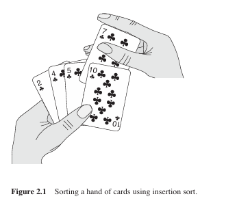
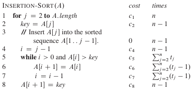
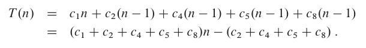
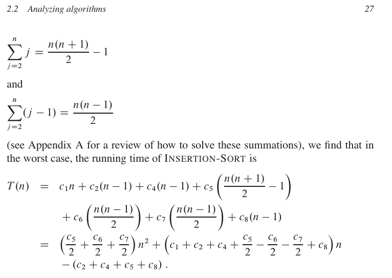

# Insertion Sort

> We start with **insertion sort**, which is an efficient algorithm for *sorting a small
 number of elements*. **Insertion sort** works the way many people sort a hand of
 playing cards. We start with an empty left hand and the cards face down on the
 table. We then remove one card at a time from the table and insert it into the
 correct position in the left hand. To find the correct position for a card, we compare
 it with each of the cards already in the hand, from right to left, as illustrated in
 Figure 2.1. At all times, the cards held in the left hand are sorted, and these cards
 were originally the top cards of the pile on the table.

 

 
 

The time “cost” of each statement and the number of times each statement is executed will give the total efficiency of the algorithm.

In the best case scenario the **Insertion sort** runs in linear time

In the worst case scenario the algorithm runs in theta of n-squared”.

We can express this worst-case running time as (an)^2+bn+c for constants a, b and c that again depend on the statement costs *c*; it is thus a quadratic function of *n*.
 
## References
1. Thomas H. Cormen, Charles E. Leiserson, Ronald L. Rivest, Clifford Stein, **Introduction to Algorithms Third Edition** (The MIT Press Cambridge, Massachusetts London England, 2009).